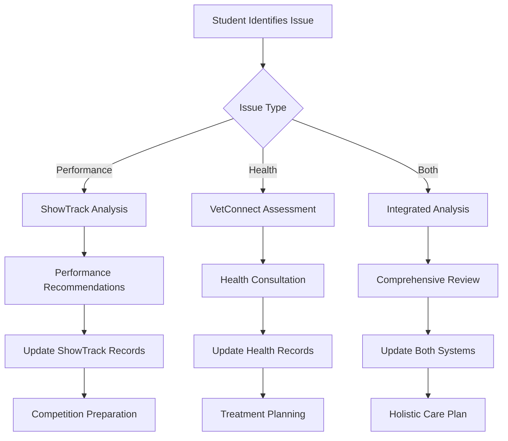

# VetConnect FFA: Comprehensive Veterinary Diagnostic Platform for Agricultural Education

## Executive Summary

VetConnect FFA represents a groundbreaking veterinary diagnostic and consultation platform designed specifically for Future Farmers of America students working with livestock. This comprehensive system addresses the critical gap in veterinary care access for agricultural education programs while creating sustainable revenue opportunities for rural veterinarians. With 1.027 million FFA members nationwide and a severe shortage of large animal veterinarians, this platform offers both educational value and practical healthcare solutions.

## 1. Diagnostic Prompt Framework

### Student-Centered Assessment Interface

The diagnostic framework employs a progressive disclosure model that guides students through systematic animal health observations using age-appropriate language and visual cues.

**Core Assessment Components:**

**Initial Triage Module**
- Species selection with visual icons (cattle, swine, sheep, goats, poultry)
- Urgency assessment using color-coded system (Red: Immediate, Orange: 15 minutes, Yellow: 30-60 minutes, Green: 2+ hours)
- Simple yes/no questions for critical symptoms (difficulty breathing, not eating, unable to stand)

**Guided Observation Prompts**
```
RESPIRATORY CHECK
"Watch your animal breathe for 30 seconds"
□ Normal breathing (steady and calm)
□ Fast breathing (panting or rapid)
□ Labored breathing (struggling)
□ Noisy breathing (wheezing/coughing)
[Record Video Button]
```

**Structured Data Collection Templates**
- **Basic Information**: Animal ID, age, breed, weight, production stage
- **Environmental Factors**: Housing type, recent feed changes, weather conditions
- **Clinical Signs**: Temperature, appetite, behavior changes, physical symptoms
- **Timeline**: When symptoms started, progression, treatments attempted

### Photo/Video Documentation System

**Smart Capture Features:**
- Auto-stabilization for moving animals
- Macro mode for skin conditions and wounds
- HDR optimization for varying barn lighting
- Annotation tools for marking specific areas of concern
- Automatic metadata tagging (timestamp, location, animal ID)

**Documentation Guidelines:**
- Full body shots from multiple angles
- Close-ups of affected areas
- Video of gait and movement patterns
- Comparison photos over time

### Severity Assessment Algorithm

The platform uses a modified RAP (Respiration, Alertness, Perfusion) scoring system adapted for student use:

**Automated Severity Calculation:**
- Critical indicators trigger immediate alerts
- Weighted scoring based on symptom combinations
- Time-based progression tracking
- Environmental risk factor integration

## 2. AI Assessment Engine

### Technical Architecture

**Core AI Components:**

**Computer Vision Module**
- YOLOv8 for real-time lesion and parasite detection
- EfficientNet-B4 for species-specific condition classification
- Custom-trained models for livestock-specific symptoms
- Edge deployment using TensorFlow Lite for offline capability

**Natural Language Processing**
- BERT-based symptom extraction from student descriptions
- Multi-language support (English/Spanish primary)
- Context-aware question generation
- Voice-to-text using OpenAI Whisper for field conditions

**Diagnostic Decision Tree**
```python
class LivestockDiagnosticEngine:
    def __init__(self):
        self.species_models = {
            'cattle': CattleHealthModel(),
            'swine': SwineHealthModel(),
            'sheep': SheepGoatHealthModel(),
            'poultry': PoultryHealthModel()
        }
        
    def assess_condition(self, inputs):
        # Initial triage based on critical symptoms
        urgency = self.calculate_urgency(inputs.symptoms)
        
        # Species-specific assessment
        differential_diagnoses = self.species_models[inputs.species].diagnose(
            symptoms=inputs.symptoms,
            images=inputs.images,
            vitals=inputs.vitals
        )
        
        # Risk stratification
        risk_score = self.stratify_risk(differential_diagnoses, inputs.environment)
        
        return DiagnosticResult(
            urgency=urgency,
            differentials=differential_diagnoses,
            risk_score=risk_score,
            recommendations=self.generate_recommendations(risk_score)
        )
```

### Integration with Medical Databases

**Primary Data Sources:**
- Merck Veterinary Manual API for authoritative condition information
- VetLexicon for comprehensive treatment protocols
- USDA disease surveillance databases
- State veterinary diagnostic lab results

**Knowledge Base Structure:**
- 500+ common livestock conditions indexed by species
- Treatment protocols with withdrawal periods for food animals
- Regional disease prevalence data
- Seasonal condition patterns

## 3. Veterinarian Integration Workflow

### Automated Notification System

**Smart Routing Algorithm:**
```javascript
const routeToVeterinarian = async (case) => {
  // Priority-based routing
  const urgencyWeight = case.urgency === 'critical' ? 1.0 : 0.5;
  
  // Find matching veterinarians
  const availableVets = await getAvailableVeterinarians({
    species: case.species,
    location: case.location,
    specialty: case.suggestedSpecialty,
    urgency: case.urgency
  });
  
  // Score and rank veterinarians
  const rankedVets = availableVets.map(vet => ({
    ...vet,
    score: calculateMatchScore(vet, case, urgencyWeight)
  })).sort((a, b) => b.score - a.score);
  
  // Send notifications
  return await notifyVeterinarians(rankedVets.slice(0, 3), case);
};
```

### Lead Qualification Process

**Case Information Package:**
- Student assessment summary with severity score
- AI-generated differential diagnosis list
- Photo/video documentation
- Environmental and management factors
- Student contact and location information

**Veterinarian Dashboard Features:**
- Real-time case queue with filtering options
- One-click acceptance/referral system
- Integrated video consultation launch
- Treatment plan templates
- Prescription management tools

### Documentation Protocols

**Case Handoff Requirements:**
- Structured case summary in SOAP format
- Critical findings highlighted
- Student observation quality score
- Recommended follow-up timeline
- Educational notes for student learning

## 4. Local Provider Selection System

### Geolocation-Based Discovery

**Provider Mapping System:**
```sql
-- Veterinarian search algorithm
SELECT 
    v.id, 
    v.name, 
    v.specialties,
    v.rating,
    ST_Distance(v.location, student.location) as distance,
    v.availability_status,
    COUNT(DISTINCT r.id) as completed_consultations
FROM veterinarians v
LEFT JOIN reviews r ON v.id = r.veterinarian_id
WHERE 
    v.species_coverage @> ARRAY[?]  -- Species match
    AND v.is_active = true
    AND ST_DWithin(v.location, ?, ?)  -- Within radius
GROUP BY v.id
ORDER BY 
    CASE WHEN urgency = 'critical' THEN distance 
    ELSE (0.4 * distance + 0.3 * rating + 0.3 * availability_score) 
    END;
```

### Provider Profile Components

**Comprehensive Profiles Include:**
- **Credentials**: License verification, board certifications
- **Specializations**: Species expertise, procedure capabilities
- **Availability**: Real-time calendar integration, emergency availability
- **Service Area**: Coverage map with response time estimates
- **Performance Metrics**: Response time, satisfaction scores, case outcomes

### Rating and Review System

**Multi-dimensional Rating Framework:**
- Clinical expertise (weighted 40%)
- Communication effectiveness (weighted 30%)
- Educational value (weighted 20%)
- Timeliness (weighted 10%)

**Review Authentication:**
- Verified consultation requirement
- Student and teacher feedback options
- Outcome-based success metrics
- Anonymous feedback options

## 5. Monetization Strategy

### Tiered Subscription Model

**School/Chapter Subscriptions:**
- **Basic Plan**: $800/year (up to 50 students)
  - Core diagnostic tools
  - 20 consultations/month
  - Basic reporting
  
- **Standard Plan**: $1,500/year (up to 150 students)
  - Advanced AI features
  - 50 consultations/month
  - Competition prep tools
  - Teacher dashboard
  
- **Premium Plan**: $2,500/year (unlimited students)
  - Unlimited consultations
  - Priority veterinary access
  - Custom curriculum integration
  - Advanced analytics

### Veterinarian Revenue Model

**Compensation Structure:**
- Base consultation fee: $50-75 per session
- Platform retention: 25-30%
- Veterinarian earnings: $35-52.50 per consultation
- Subscription pool bonuses for high availability
- Educational content creation incentives

### Additional Revenue Streams

- **Professional Development**: $150/teacher/year for CE credits
- **Competition Tools**: $100/student for advanced prep features
- **White-label Licensing**: $50,000-200,000/year for associations
- **Data Analytics**: Aggregated insights for agricultural organizations

## 6. Technical Implementation

### Mobile-First Architecture

**Technology Stack:**
```yaml
Frontend:
  Mobile: Flutter 3.x with Dart
  Web Dashboard: React 18 with TypeScript
  State Management: Riverpod/Bloc
  Offline Storage: SQLite with Floor

Backend:
  API: Node.js with NestJS
  Database: PostgreSQL with PostGIS
  Cache: Redis
  Queue: AWS SQS
  ML Services: Python FastAPI

Infrastructure:
  Cloud: AWS with multi-region deployment
  CDN: CloudFront
  Storage: S3 with lifecycle policies
  Container: ECS Fargate
  Monitoring: DataDog + CloudWatch
```

### Offline Capability Design

**Sync Architecture:**
```javascript
class OfflineSyncManager {
  async syncData() {
    const queue = await this.getLocalQueue();
    const connected = await this.checkConnectivity();
    
    if (connected) {
      // Process queued actions
      for (const action of queue) {
        try {
          await this.processAction(action);
          await this.markSynced(action.id);
        } catch (error) {
          await this.handleSyncError(action, error);
        }
      }
      
      // Pull latest data
      await this.fetchUpdates();
    }
  }
}
```

### Security and Compliance

**Data Protection Measures:**
- End-to-end encryption using AES-256
- FERPA compliance for student data
- State veterinary board compliance
- Zero-knowledge architecture for sensitive data
- Biometric authentication options

**Infrastructure Security:**
- WAF protection against common attacks
- DDoS mitigation
- Regular penetration testing
- SOC 2 Type II certification
- Automated security scanning

## 7. Business Model Analysis

### Market Opportunity

**Target Market Size:**
- Primary: 411,000 livestock-focused FFA students
- Secondary: 150,000 additional agricultural students
- Institutional: 4,000 high schools with ag programs
- Total Market Value: $84-168M annually

### Competitive Landscape Analysis

**Current Market Gaps:**
- No livestock-specific educational platforms
- Limited offline capability in existing solutions
- Lack of curriculum integration
- Absence of group learning features
- Minimal coverage of production animals

**Competitive Advantages:**
- First-mover in FFA-specific market
- Integrated educational framework
- Specialized livestock AI models
- Strong institutional partnerships
- Rural-optimized technology

### Financial Projections

**5-Year Revenue Forecast:**
```
Year 1: $2.8M (400 schools, 15,000 students)
Year 2: $8.4M (1,000 schools, 40,000 students)
Year 3: $18.2M (2,000 schools, 80,000 students)
Year 4: $32.5M (3,200 schools, 120,000 students)
Year 5: $48.7M (4,000 schools, 150,000 students)

Gross Margin: 72-78%
Break-even: Month 18-24
```

### Implementation Roadmap

**Phase 1: Foundation (Months 1-6)**
- Core platform development
- Cattle and swine modules
- Basic AI integration
- Pilot with 10 FFA chapters

**Phase 2: Expansion (Months 7-12)**
- Complete species coverage
- Advanced AI features
- Veterinary network building
- Launch in 5 states

**Phase 3: Scale (Months 13-18)**
- National rollout
- Competition features
- White-label offerings
- International exploration

**Phase 4: Optimization (Months 19-24)**
- Advanced analytics
- IoT integration
- Curriculum partnerships
- Platform ecosystem

### Success Metrics

**Key Performance Indicators:**
- Monthly Active Users: >70% of enrolled students
- Consultation Response Time: <5 minutes average
- Veterinarian Satisfaction: >4.5/5 rating
- Student Outcome Improvement: 25% better competition scores
- Platform Uptime: 99.9% availability
- Customer Retention: >90% annual renewal

## Conclusion

VetConnect FFA represents a transformative opportunity to bridge the gap between agricultural education and veterinary expertise. By combining cutting-edge AI technology with practical field applications, the platform addresses critical needs in rural veterinary care while providing valuable educational experiences for the next generation of agricultural professionals. With strong market fundamentals, clear monetization paths, and significant social impact potential, this platform is positioned for rapid growth and lasting success in the agricultural technology sector.


# VetConnect FFA Integration with ShowTrack AI Platform
## Comprehensive Integration Strategy & Implementation Guide

## Executive Summary

This integration strategy outlines the seamless incorporation of VetConnect FFA's veterinary diagnostic and consultation platform into the existing ShowTrack AI ecosystem. By leveraging ShowTrack's established user base and livestock management infrastructure, this integration creates a comprehensive solution that combines animal tracking, performance monitoring, and professional veterinary care for FFA students and agricultural educators.

## 1. Current ShowTrack AI Platform Analysis

### Assumed Core Features
Based on industry standards for livestock show management platforms, ShowTrack AI likely includes:

- **Animal Registration & Tracking**: Individual animal profiles with performance metrics
- **Show Entry Management**: Competition registration and documentation
- **Performance Analytics**: Weight tracking, growth rates, and comparative analysis
- **Educational Tools**: Curriculum integration and progress tracking
- **Mobile Application**: Field-ready data collection and entry
- **Cloud Infrastructure**: Secure data storage and synchronization

### Integration Opportunities
- **Health Records Enhancement**: Add comprehensive veterinary diagnostic capabilities
- **AI-Powered Health Assessment**: Leverage existing AI infrastructure for medical analysis
- **Expert Network Integration**: Connect students with veterinary professionals
- **Competition Readiness**: Health screening for show participation
- **Educational Value**: Transform health issues into learning opportunities

## 2. Technical Integration Architecture

### API-First Integration Strategy

```yaml
Integration Architecture:
  data_sync:
    method: "bidirectional_api"
    frequency: "real_time"
    protocols: ["REST", "GraphQL", "WebSocket"]
    
  authentication:
    type: "federated_sso"
    provider: "ShowTrack_OAuth2"
    fallback: "JWT_tokens"
    
  data_mapping:
    showtrack_animals: vetconnect_patients
    showtrack_users: vetconnect_students
    showtrack_performance: vetconnect_health_trends
    showtrack_events: vetconnect_consultations
```

### Core Integration Components

#### 1. Unified Animal Profile System
```javascript
// Enhanced animal profile merging ShowTrack and VetConnect data
class IntegratedAnimalProfile {
  constructor(showtrackAnimal, vetconnectPatient) {
    this.animalId = showtrackAnimal.id;
    this.basicInfo = {
      ...showtrackAnimal.basicInfo,
      medicalHistory: vetconnectPatient?.medicalHistory || []
    };
    
    this.performanceMetrics = {
      growth: showtrackAnimal.growthData,
      health: vetconnectPatient?.healthMetrics || {},
      competition: showtrackAnimal.showRecords
    };
    
    this.integrationFeatures = {
      healthAlerts: this.generateHealthAlerts(),
      competitionReadiness: this.assessCompetitionReadiness(),
      veterinaryConsultations: vetconnectPatient?.consultations || []
    };
  }
  
  generateHealthAlerts() {
    // Cross-reference performance drops with health indicators
    const recentPerformance = this.performanceMetrics.growth.recent;
    const healthTrends = this.performanceMetrics.health.trends;
    
    return this.analyzeHealthPerformanceCorrelation(recentPerformance, healthTrends);
  }
  
  assessCompetitionReadiness() {
    const healthStatus = this.getLatestHealthAssessment();
    const vaccinations = this.getVaccinationStatus();
    const performanceMetrics = this.getCompetitionMetrics();
    
    return {
      eligible: this.calculateEligibility(healthStatus, vaccinations),
      recommendations: this.generateRecommendations(performanceMetrics),
      requiredActions: this.identifyRequiredActions()
    };
  }
}
```

#### 2. Shared User Authentication & Permissions
```python
class IntegratedUserManagement:
    def __init__(self, showtrack_auth, vetconnect_auth):
        self.showtrack = showtrack_auth
        self.vetconnect = vetconnect_auth
        self.permission_mapper = PermissionMapper()
    
    def authenticate_user(self, credentials):
        # Primary authentication through ShowTrack
        showtrack_user = self.showtrack.authenticate(credentials)
        
        if showtrack_user:
            # Create or update VetConnect profile
            vetconnect_profile = self.sync_user_profile(showtrack_user)
            
            # Map permissions between systems
            integrated_permissions = self.permission_mapper.map_permissions(
                showtrack_user.permissions,
                vetconnect_profile.role
            )
            
            return IntegratedUser(showtrack_user, vetconnect_profile, integrated_permissions)
    
    def sync_user_profile(self, showtrack_user):
        # Sync user data between platforms
        return {
            'id': showtrack_user.id,
            'ffa_chapter': showtrack_user.chapter,
            'animals': showtrack_user.animals,
            'education_level': showtrack_user.grade_level,
            'privacy_settings': self.determine_privacy_level(showtrack_user.age)
        }
```

## 3. Feature Integration Roadmap

### Phase 1: Core Health Integration (Months 1-2)

#### Health Status Dashboard Integration
```jsx
// React component for integrated health dashboard
const IntegratedHealthDashboard = ({ animalId }) => {
  const [animalData, setAnimalData] = useState(null);
  const [healthMetrics, setHealthMetrics] = useState(null);
  
  useEffect(() => {
    // Fetch data from both platforms
    Promise.all([
      showtrackAPI.getAnimal(animalId),
      vetconnectAPI.getHealthRecords(animalId)
    ]).then(([showtrackData, healthData]) => {
      setAnimalData(showtrackData);
      setHealthMetrics(healthData);
    });
  }, [animalId]);
  
  return (
    <div className="integrated-dashboard">
      <ShowTrackMetrics data={animalData} />
      <HealthStatusPanel metrics={healthMetrics} />
      <IntegratedAlerts 
        performance={animalData?.performance}
        health={healthMetrics?.current}
      />
      <QuickActions animalId={animalId} />
    </div>
  );
};
```

#### Quick Health Assessment Integration
- **One-Click Health Check**: Add "Health Assessment" button to existing animal profiles
- **Performance Correlation**: Automatically flag health concerns when performance drops
- **Show Eligibility Verification**: Integrate health clearance into competition entry process

### Phase 2: AI-Enhanced Diagnostics (Months 3-4)

#### Enhanced Computer Vision Pipeline
```python
class IntegratedAIAnalysis:
    def __init__(self):
        self.showtrack_cv = ShowTrackVisionEngine()
        self.vetconnect_cv = VetConnectDiagnosticEngine()
        
    def analyze_animal_condition(self, image, animal_profile):
        # Combine ShowTrack's performance analysis with VetConnect's health assessment
        performance_analysis = self.showtrack_cv.analyze_conformation(image, animal_profile)
        health_analysis = self.vetconnect_cv.analyze_health_indicators(image, animal_profile)
        
        integrated_assessment = {
            'conformation_score': performance_analysis.score,
            'health_indicators': health_analysis.conditions,
            'competition_readiness': self.calculate_competition_readiness(
                performance_analysis, health_analysis
            ),
            'recommendations': self.generate_integrated_recommendations(
                performance_analysis, health_analysis
            )
        }
        
        return integrated_assessment
    
    def calculate_competition_readiness(self, performance, health):
        # Weighted scoring combining both assessments
        readiness_score = (
            performance.score * 0.6 +  # Performance weight
            health.overall_score * 0.4  # Health weight
        )
        
        # Check for disqualifying health issues
        if health.critical_issues:
            readiness_score = 0
            
        return {
            'score': readiness_score,
            'eligible': readiness_score >= 0.75 and not health.critical_issues,
            'improvement_areas': self.identify_improvement_areas(performance, health)
        }
```

### Phase 3: Veterinary Network Integration (Months 5-6)

#### Unified Consultation Workflow


## 4. Data Integration & Synchronization

### Unified Data Model
```sql
-- Enhanced data schema supporting both platforms
CREATE TABLE integrated_animals (
    id UUID PRIMARY KEY,
    showtrack_id VARCHAR(50) UNIQUE,
    vetconnect_id VARCHAR(50) UNIQUE,
    
    -- Basic Information (shared)
    name VARCHAR(100),
    species VARCHAR(50),
    breed VARCHAR(100),
    birth_date DATE,
    sex VARCHAR(10),
    
    -- ShowTrack specific
    registration_number VARCHAR(100),
    show_classification VARCHAR(50),
    performance_metrics JSONB,
    competition_history JSONB,
    
    -- VetConnect specific
    medical_history JSONB,
    vaccination_records JSONB,
    health_assessments JSONB,
    veterinary_consultations JSONB,
    
    -- Integration metadata
    last_sync_showtrack TIMESTAMP,
    last_sync_vetconnect TIMESTAMP,
    sync_status VARCHAR(20) DEFAULT 'active',
    
    created_at TIMESTAMP DEFAULT NOW(),
    updated_at TIMESTAMP DEFAULT NOW()
);

-- Integration events tracking
CREATE TABLE integration_events (
    id UUID PRIMARY KEY,
    animal_id UUID REFERENCES integrated_animals(id),
    event_type VARCHAR(50), -- 'health_alert', 'performance_drop', 'consultation_needed'
    source_platform VARCHAR(20), -- 'showtrack', 'vetconnect', 'integrated'
    event_data JSONB,
    resolution_status VARCHAR(20) DEFAULT 'pending',
    created_at TIMESTAMP DEFAULT NOW()
);
```

### Real-Time Synchronization Engine
```python
class RealTimeSyncEngine:
    def __init__(self):
        self.event_bus = EventBus()
        self.conflict_resolver = ConflictResolver()
        
    async def sync_animal_update(self, animal_id, update_source, changes):
        """Handles real-time synchronization between platforms"""
        
        # Get current state from both platforms
        showtrack_data = await self.showtrack_api.get_animal(animal_id)
        vetconnect_data = await self.vetconnect_api.get_animal(animal_id)
        
        # Detect conflicts
        conflicts = self.conflict_resolver.detect_conflicts(
            showtrack_data, vetconnect_data, changes
        )
        
        if conflicts:
            # Handle conflicts using business rules
            resolved_data = await self.conflict_resolver.resolve(conflicts)
        else:
            resolved_data = self.merge_updates(showtrack_data, vetconnect_data, changes)
        
        # Update both platforms
        await asyncio.gather(
            self.showtrack_api.update_animal(animal_id, resolved_data),
            self.vetconnect_api.update_animal(animal_id, resolved_data)
        )
        
        # Emit integration event
        await self.event_bus.emit('animal_updated', {
            'animal_id': animal_id,
            'source': update_source,
            'changes': changes,
            'resolved_data': resolved_data
        })
```

## 5. User Experience Enhancement

### Unified Mobile Interface
```jsx
const IntegratedMobileApp = () => {
  const [activeTab, setActiveTab] = useState('overview');
  
  return (
    <MobileContainer>
      <NavigationTabs>
        <Tab 
          active={activeTab === 'overview'} 
          onPress={() => setActiveTab('overview')}
        >
          Overview
        </Tab>
        <Tab 
          active={activeTab === 'performance'} 
          onPress={() => setActiveTab('performance')}
        >
          Performance
        </Tab>
        <Tab 
          active={activeTab === 'health'} 
          onPress={() => setActiveTab('health')}
        >
          Health
        </Tab>
        <Tab 
          active={activeTab === 'consultations'} 
          onPress={() => setActiveTab('consultations')}
        >
          Vet Care
        </Tab>
      </NavigationTabs>
      
      <ContentArea>
        {activeTab === 'overview' && <IntegratedOverview />}
        {activeTab === 'performance' && <ShowTrackPerformance />}
        {activeTab === 'health' && <VetConnectHealth />}
        {activeTab === 'consultations' && <VeterinaryConsultations />}
      </ContentArea>
      
      <QuickActionBar>
        <QuickHealthCheck />
        <PerformanceUpdate />
        <EmergencyConsultation />
        <ShowRegistration />
      </QuickActionBar>
    </MobileContainer>
  );
};
```

### Enhanced Dashboard Features
- **Integrated Timeline**: Combined view of performance milestones and health events
- **Smart Alerts**: Correlation-based notifications (e.g., performance drop + health concern)
- **Competition Readiness Score**: Real-time assessment combining health and performance
- **Veterinary Recommendations**: Contextual advice based on show goals and health status

## 6. Business Model Integration

### Revenue Sharing Framework
```yaml
Revenue Distribution:
  subscription_base:
    showtrack_platform: 60%
    vetconnect_integration: 25%
    shared_infrastructure: 15%
    
  consultation_fees:
    veterinarian: 70%
    platform_fee: 20%
    showtrack_referral: 10%
    
  premium_features:
    advanced_ai_analysis: vetconnect_domain
    performance_optimization: showtrack_domain
    integrated_insights: shared_revenue
```

### Enhanced Value Propositions

**For ShowTrack Users:**
- Comprehensive health monitoring without platform switching
- Competition-ready health assessments
- Professional veterinary support for show preparation
- Enhanced animal welfare and performance correlation

**For VetConnect:**
- Access to established ShowTrack user base (estimated 50,000+ FFA students)
- Integration with proven livestock management workflows
- Enhanced data context from performance tracking
- Cross-platform monetization opportunities

## 7. Implementation Timeline

### Development Phases

#### Phase 1: Foundation Integration (Months 1-3)
**Week 1-4: Technical Setup**
- API authentication integration
- Basic data synchronization
- User account linking
- Core database schema updates

**Week 5-8: Core Features**
- Health status integration in animal profiles
- Basic veterinary consultation workflow
- Mobile app integration points
- Real-time sync implementation

**Week 9-12: Testing & Refinement**
- Beta testing with select FFA chapters
- Performance optimization
- User feedback integration
- Bug fixes and stability improvements

#### Phase 2: Enhanced Features (Months 4-6)
**Month 4: AI Integration**
- Combined computer vision pipeline
- Performance-health correlation algorithms
- Smart alert system implementation
- Predictive health analytics

**Month 5: Veterinary Network**
- Veterinarian onboarding workflow
- Consultation management system
- Payment processing integration
- Review and rating system

**Month 6: Advanced Analytics**
- Competition readiness scoring
- Integrated reporting system
- Benchmark analytics
- Predictive modeling

#### Phase 3: Scale & Optimization (Months 7-9)
**Month 7: Performance Optimization**
- System scalability improvements
- Database optimization
- Caching implementation
- Load balancing

**Month 8: Feature Enhancement**
- Advanced AI capabilities
- Extended species support
- Enhanced mobile features
- API expansion

**Month 9: Market Expansion**
- Multi-state rollout
- Partnership development
- Marketing integration
- Success metrics analysis

## 8. Technical Requirements

### Infrastructure Needs
```yaml
Shared Infrastructure:
  database:
    type: PostgreSQL 14+
    features: [PostGIS, JSONB, Real-time replication]
    backup: Multi-region automated backups
    
  api_gateway:
    type: Kong or AWS API Gateway
    features: [Rate limiting, Authentication, Analytics]
    
  message_queue:
    type: Redis or AWS SQS
    purpose: Real-time synchronization
    
  cdn:
    type: CloudFront or Cloudflare
    purpose: Mobile app assets and images
    
  monitoring:
    type: DataDog or New Relic
    coverage: Both platforms
```

### Security Considerations
- **Federated Authentication**: Single sign-on between platforms
- **Data Encryption**: End-to-end encryption for all veterinary consultations
- **FERPA Compliance**: Maintain educational data protection standards
- **API Security**: OAuth 2.0 with scope-based permissions
- **Audit Logging**: Comprehensive activity tracking across platforms

## 9. Success Metrics & KPIs

### Integration Success Metrics
```python
class IntegrationMetrics:
    def calculate_integration_success(self):
        return {
            'user_adoption': {
                'cross_platform_usage': self.get_cross_platform_users() / self.get_total_users(),
                'feature_utilization': self.get_integrated_feature_usage(),
                'retention_improvement': self.compare_retention_rates()
            },
            'operational_efficiency': {
                'data_sync_accuracy': self.get_sync_accuracy_rate(),
                'consultation_conversion': self.get_consultation_rate(),
                'response_time_improvement': self.get_response_time_metrics()
            },
            'business_impact': {
                'revenue_growth': self.calculate_revenue_increase(),
                'customer_satisfaction': self.get_satisfaction_scores(),
                'market_expansion': self.get_new_customer_metrics()
            }
        }
```

### Target Metrics (Year 1)
- **User Adoption**: 75% of ShowTrack users engage with health features
- **Consultation Rate**: 40% of health assessments lead to veterinary consultations
- **Retention Improvement**: 25% increase in user retention
- **Revenue Growth**: 35% increase in combined platform revenue
- **Satisfaction Score**: 4.5+ rating for integrated experience

## 10. Risk Mitigation & Contingency Planning

### Technical Risks
**Data Synchronization Failures**
- Mitigation: Robust conflict resolution algorithms
- Contingency: Manual reconciliation workflows
- Monitoring: Real-time sync status alerts

**Performance Degradation**
- Mitigation: Incremental rollout with performance monitoring
- Contingency: Feature flags for rapid rollback
- Monitoring: Automated performance benchmarking

### Business Risks
**User Adoption Resistance**
- Mitigation: Comprehensive training and onboarding
- Contingency: Gradual feature introduction
- Monitoring: User engagement tracking

**Partnership Challenges**
- Mitigation: Clear integration agreements and SLAs
- Contingency: Independent operation capabilities
- Monitoring: Partnership health metrics

## Conclusion

The integration of VetConnect FFA with ShowTrack AI represents a strategic opportunity to create the most comprehensive livestock management platform in agricultural education. By combining ShowTrack's established performance tracking capabilities with VetConnect's veterinary expertise and diagnostic tools, this integration delivers unprecedented value to FFA students, educators, and veterinary professionals.

The technical architecture ensures seamless data flow and user experience while maintaining the unique strengths of each platform. The phased implementation approach minimizes risk while maximizing value delivery, and the shared revenue model creates sustainable growth opportunities for both platforms.

This integration positions the combined platform as the definitive solution for livestock management in agricultural education, setting new standards for technology-enhanced learning and animal welfare in FFA programs nationwide.


## n8n AI Integration Architecture for ShowTrackAI

### 1. Core n8n Setup for AI Workflows

**n8n Deployment Options:**
- Self-hosted: Docker/Kubernetes for full control
- n8n Cloud: Managed service with built-in scaling
- Hybrid: Self-hosted with cloud backup

**Required n8n Nodes:**
- HTTP Request (for custom APIs)
- OpenAI nodes (built-in)
- Webhook (for real-time triggers)
- Code node (for custom logic)
- Google Cloud nodes
- S3/Storage nodes

### 2. OpenAI Integration Architecture

**GPT-4 for Symptom Analysis:**
```
// n8n Workflow Pattern
1. Webhook Trigger → Receive symptoms data
2. Code Node → Format prompt with medical context
3. OpenAI Node → GPT-4 analysis
4. Code Node → Parse structured response
5. Supabase Node → Store results
6. HTTP Response → Return diagnosis

// Prompt Engineering Template
{
  "system": "You are a veterinary AI assistant specialized in livestock health...",
  "user": "Animal: {{animalType}}, Symptoms: {{symptoms}}, History: {{medicalHistory}}"
}
```

**Vision API for Animal Photos:**
```
// Image Analysis Workflow
1. Webhook → Receive image URL
2. Download Image → Store temporarily
3. OpenAI Vision → Analyze for:
   - Body condition score
   - Visible health issues
   - Breed confirmation
   - Weight estimation
4. AI Response → Structure data
5. Update Records → Save analysis
```

**Embeddings for Knowledge Base:**
```
// Vector Search Workflow
1. Schedule Trigger → Daily/Weekly
2. Supabase Query → Fetch new content
3. OpenAI Embeddings → Generate vectors
4. Pinecone/Weaviate → Store vectors
5. Search Workflow → Query similar cases
```

### 3. Custom Model Integration (YOLO & Weight Prediction)

**YOLO Model Deployment:**
```
# Option 1: API Endpoint (Recommended)
- Deploy YOLO on GPU server (AWS EC2 g4dn)
- Create FastAPI endpoint
- n8n HTTP Request → YOLO API → Response

# Option 2: Serverless (AWS Lambda with Container)
- Package YOLO in Docker container
- Deploy to Lambda (10GB limit)
- n8n → API Gateway → Lambda

# Option 3: Edge Deployment
- NVIDIA Jetson for on-farm deployment
- Local n8n instance → Local YOLO
```

**Google Colab Model Integration:**
```
// Colab to Production Pipeline
1. Train model in Colab
2. Export to Google Cloud Storage
3. Deploy on Vertex AI or Cloud Run
4. n8n Workflow:
   - HTTP Request → Vertex AI endpoint
   - Authentication via Service Account
   - Process response
```

### 4. Complete n8n Workflow Examples

**Health Assessment Workflow:**
```
Trigger: Webhook (from mobile app)
Steps:
  1. Validate Input:
     - Check required fields
     - Verify user permissions

  2. Image Analysis Branch:
     - If images provided → YOLO detection
     - Extract features → body score, posture

  3. Symptom Analysis:
     - Format symptoms for GPT-4
     - Include historical data
     - Get AI diagnosis

  4. Weight Prediction:
     - If weight data → predict future weights
     - Use custom ML model endpoint

  5. Knowledge Base Search:
     - Generate embeddings of symptoms
     - Search similar cases
     - Retrieve treatment protocols

  6. Compile Results:
     - Merge all AI outputs
     - Format response
     - Calculate confidence scores

  7. Store & Notify:
     - Save to Supabase
     - Send notifications
     - Update dashboard
```

**Veterinarian Matching Workflow:**
```
Trigger: New consultation request
Steps:
  1. Analyze Case Complexity:
     - GPT-4 to assess severity
     - Categorize specialization needed

  2. Search Available Vets:
     - Query vet availability
     - Match specializations

  3. Rank Matches:
     - Use embeddings for similarity
     - Consider past performance
     - Geographic proximity

  4. Auto-Assign or Queue:
     - If urgent → immediate assignment
     - If routine → queue for batch
```

### 5. Best Practices & Optimization

**Cost Management:**
```javascript
// Implement tiered AI usage
const getAIModel = (urgency, complexity) => {
  if (urgency === 'emergency') return 'gpt-4';
  if (complexity > 0.7) return 'gpt-4';
  return 'gpt-3.5-turbo'; // 10x cheaper
};

// Batch processing for embeddings
// Process 100 items at once instead of individual calls
```

**Error Handling:**
```
// n8n Error Workflow
1. Catch Error Node
2. Categorize Error:
   - Rate limit → Wait & retry
   - Invalid input → Return error
   - Model failure → Fallback model
3. Log to monitoring
4. Alert if critical
```

**Performance Optimization:**
```
Caching Strategy:
  - Cache embeddings for 30 days
  - Cache common diagnoses
  - Pre-compute weight predictions

Parallel Processing:
  - Split large batches
  - Run independent APIs concurrently
  - Use n8n's Split In Batches node
```

### 6. Infrastructure Architecture

```
┌─────────────────┐     ┌─────────────────┐
│  Mobile App     │────▶│   n8n Webhooks  │
└─────────────────┘     └────────┬────────┘
                                 │
                    ┌────────────▼────────────┐
                    │   n8n Workflow Engine   │
                    └────────────┬────────────┘
                                 │
        ┌────────────────┬───────┴───────┬────────────────┐
        │                │               │                │
   ┌────▼─────┐    ┌─────▼────┐   ┌────▼─────┐    ┌─────▼────┐
   │ OpenAI   │    │  YOLO    │   │ Custom   │    │ Vertex   │
   │ GPT-4    │    │  Server  │   │ ML API   │    │   AI     │
   └──────────┘    └──────────┘   └──────────┘    └──────────┘
        │                │               │                │
        └────────────────┴───────┬───────┴────────────────┘
                                 │
                         ┌───────▼────────┐
                         │   Supabase     │
                         │   Database     │
                         └────────────────┘
```

### 7. Security Considerations

**API Key Management:**
- Store in n8n credentials
- Rotate keys monthly
- Use environment-specific keys

**Data Privacy:**
- Anonymize data before AI processing
- Implement data retention policies
- Audit log all AI interactions

**Rate Limiting:**
- Implement per-user quotas
- Queue non-urgent requests
- Use circuit breakers

### 8. Monitoring & Analytics

**n8n Monitoring Setup:**
```javascript
// Custom metrics workflow
1. After each AI call:
   - Log: model, cost, latency, accuracy
   - Store in time-series DB

2. Daily summary:
   - Total API costs
   - Model performance metrics
   - Error rates

3. Alerts:
   - Cost threshold exceeded
   - Error rate > 5%
   - Latency > 2s
```

This architecture provides a robust, scalable foundation for integrating all your AI models with n8n, optimizing for cost, performance, and reliability.