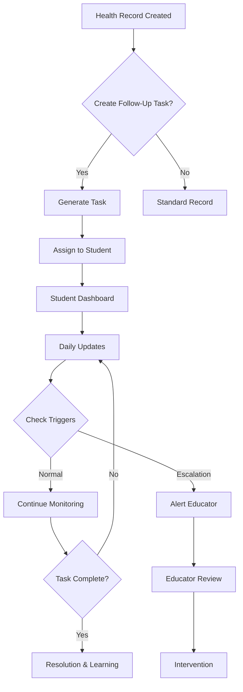

# FFA Medical Follow-Up & Educator Dashboard System Overview

## 🎯 System Purpose

The FFA Medical Follow-Up & Educator Dashboard System is a comprehensive solution designed to ensure systematic health monitoring of agricultural animals while providing educational value through competency-based learning. This system bridges the gap between students and educators, ensuring no health issues go unaddressed while developing professional skills aligned with AET standards.

## 🏗️ System Architecture

### Core Components

```
┌─────────────────────────────────────────────────────────────┐
│                    FFA Medical Follow-Up System              │
├─────────────────────────────────────────────────────────────┤
│                                                             │
│  ┌─────────────────┐         ┌──────────────────┐         │
│  │  Student Portal  │         │ Educator Dashboard│         │
│  │                 │         │                  │         │
│  │ • Pending Tasks │◄────────┤ • Student Monitor│         │
│  │ • Add Updates   │         │ • Analytics      │         │
│  │ • View Progress │         │ • Interventions  │         │
│  └────────┬────────┘         └────────┬─────────┘         │
│           │                            │                    │
│           └──────────┬─────────────────┘                   │
│                      │                                      │
│           ┌──────────▼─────────────┐                      │
│           │   Core Services        │                      │
│           │                        │                      │
│           │ • Task Management      │                      │
│           │ • Alert System         │                      │
│           │ • Data Persistence     │                      │
│           │ • Sync Engine          │                      │
│           └────────────────────────┘                      │
└─────────────────────────────────────────────────────────────┘
```

### Data Flow Architecture



## 🔑 Key Features

### For Students
1. **Pending Health Issues Dashboard**
   - Prioritized task list (Urgent, Scheduled, Monitoring)
   - Real-time progress tracking
   - Visual status indicators

2. **Interactive Task Management**
   - Photo documentation with quality validation
   - Temperature and measurement recording
   - Observation notes with guided prompts

3. **Learning Integration**
   - Competency standard tracking
   - Reflection requirements
   - Confidence level assessment

### For Educators
1. **Chapter Health Overview**
   - Active case monitoring
   - Student engagement metrics
   - Performance analytics

2. **Student Health Profiles**
   - Individual performance tracking
   - Intervention history
   - Competency progress visualization

3. **Analytics Dashboard**
   - Trend analysis
   - Common issue identification
   - Resolution time tracking

## 📊 Technical Specifications

### Data Models
- **FollowUpTask**: Core task structure with scheduling and progress
- **FollowUpUpdate**: Student submissions with measurements and photos
- **HealthAlert**: Notification and escalation system
- **EducatorMonitoring**: Intervention tracking and settings

### Services
- **FollowUpTaskService**: Task lifecycle management
- **NotificationEngine**: Alert delivery and prioritization
- **SyncService**: Offline capability and data synchronization
- **AnalyticsService**: Performance metrics and insights

### Storage Architecture
```
@ShowTrackAI:followUpTasks     → Active and completed tasks
@ShowTrackAI:followUpUpdates   → Student submissions
@ShowTrackAI:healthAlerts      → System notifications
@ShowTrackAI:educatorMonitoring → Educator preferences
```

## 🎓 Educational Alignment

### AET Competency Standards
- **AS.07.01.02.a**: Systematic health monitoring procedures
- **AS.07.02.01.b**: Data collection and analysis skills
- **AS.07.03.01.a**: Health intervention protocols
- **AS.07.04.01.a**: Professional communication in health contexts

### Learning Outcomes
1. Develop systematic observation skills
2. Practice data-driven decision making
3. Build professional documentation habits
4. Enhance critical thinking in health assessment

## 🔐 Security & Privacy

### Data Protection
- Role-based access control
- Student data isolation
- Educator supervision boundaries
- FERPA compliance considerations

### Audit Trail
- All actions logged with timestamps
- Intervention documentation
- Learning outcome tracking
- Quality score history

## 🚀 Implementation Timeline

### Phase 1: Core System (Completed)
- Task management infrastructure
- Basic student dashboard
- Educator monitoring tools

### Phase 2: Enhanced Features (Current)
- Advanced analytics
- AI-powered insights
- Predictive alerts

### Phase 3: Integration (Planned)
- Full AET system sync
- Veterinary portal access
- Parent/guardian notifications

## 📈 Success Metrics

### Student Engagement
- Daily active usage rate
- Task completion percentage
- Documentation quality scores
- Learning reflection depth

### Health Outcomes
- Early detection rate
- Resolution timeframes
- Escalation accuracy
- Prevention effectiveness

### Educational Impact
- Competency achievement rates
- Skill development progression
- Professional readiness indicators
- Career pathway alignment

## 🔗 System Integration Points

### Existing Systems
- FFA Medical Records
- AET Journal Platform
- Animal Management Database
- Financial Tracking System

### External Connections
- Veterinary consultation portal
- Weather data services
- Feed supplier databases
- Competition management tools

## 📱 Platform Support

### Mobile Application
- Offline-first architecture
- Camera integration for photos
- Push notification support
- Biometric authentication

### Web Dashboard
- Responsive design
- Real-time updates
- Export capabilities
- Print-friendly reports

## 🆘 Support Resources

### For Students
- In-app guidance
- Video tutorials
- Peer mentoring connections
- FAQ database

### For Educators
- Training webinars
- Best practices guide
- Intervention playbooks
- Technical support portal

---

*This system represents a comprehensive approach to agricultural education, combining practical health management with structured learning outcomes to prepare students for careers in animal agriculture.*