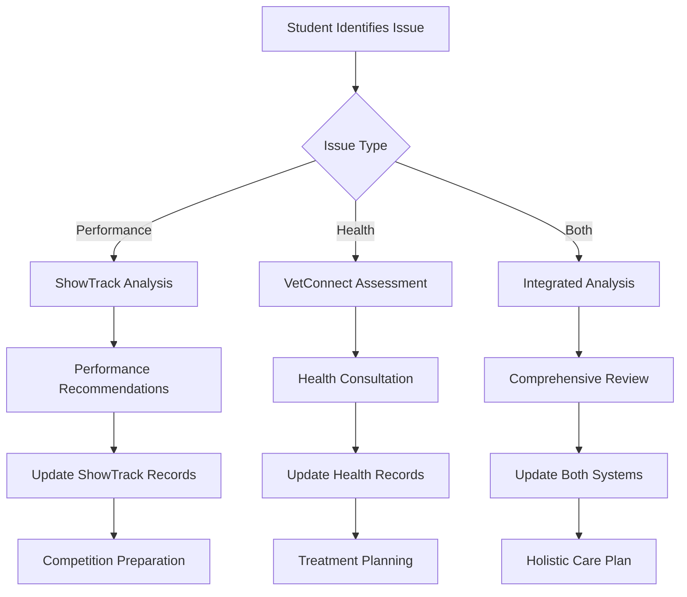

# VetConnect FFA Integration with ShowTrack AI Platform
## Comprehensive Integration Strategy & Implementation Guide

## Executive Summary

This integration strategy outlines the seamless incorporation of VetConnect FFA's veterinary diagnostic and consultation platform into the existing ShowTrack AI ecosystem. By leveraging ShowTrack's established user base and livestock management infrastructure, this integration creates a comprehensive solution that combines animal tracking, performance monitoring, and professional veterinary care for FFA students and agricultural educators.

## 1. Current ShowTrack AI Platform Analysis

### Assumed Core Features
Based on industry standards for livestock show management platforms, ShowTrack AI likely includes:

- **Animal Registration & Tracking**: Individual animal profiles with performance metrics
- **Show Entry Management**: Competition registration and documentation
- **Performance Analytics**: Weight tracking, growth rates, and comparative analysis
- **Educational Tools**: Curriculum integration and progress tracking
- **Mobile Application**: Field-ready data collection and entry
- **Cloud Infrastructure**: Secure data storage and synchronization

### Integration Opportunities
- **Health Records Enhancement**: Add comprehensive veterinary diagnostic capabilities
- **AI-Powered Health Assessment**: Leverage existing AI infrastructure for medical analysis
- **Expert Network Integration**: Connect students with veterinary professionals
- **Competition Readiness**: Health screening for show participation
- **Educational Value**: Transform health issues into learning opportunities

## 2. Technical Integration Architecture

### API-First Integration Strategy

```yaml
Integration Architecture:
  data_sync:
    method: "bidirectional_api"
    frequency: "real_time"
    protocols: ["REST", "GraphQL", "WebSocket"]
    
  authentication:
    type: "federated_sso"
    provider: "ShowTrack_OAuth2"
    fallback: "JWT_tokens"
    
  data_mapping:
    showtrack_animals: vetconnect_patients
    showtrack_users: vetconnect_students
    showtrack_performance: vetconnect_health_trends
    showtrack_events: vetconnect_consultations
```

### Core Integration Components

#### 1. Unified Animal Profile System
```javascript
// Enhanced animal profile merging ShowTrack and VetConnect data
class IntegratedAnimalProfile {
  constructor(showtrackAnimal, vetconnectPatient) {
    this.animalId = showtrackAnimal.id;
    this.basicInfo = {
      ...showtrackAnimal.basicInfo,
      medicalHistory: vetconnectPatient?.medicalHistory || []
    };
    
    this.performanceMetrics = {
      growth: showtrackAnimal.growthData,
      health: vetconnectPatient?.healthMetrics || {},
      competition: showtrackAnimal.showRecords
    };
    
    this.integrationFeatures = {
      healthAlerts: this.generateHealthAlerts(),
      competitionReadiness: this.assessCompetitionReadiness(),
      veterinaryConsultations: vetconnectPatient?.consultations || []
    };
  }
  
  generateHealthAlerts() {
    // Cross-reference performance drops with health indicators
    const recentPerformance = this.performanceMetrics.growth.recent;
    const healthTrends = this.performanceMetrics.health.trends;
    
    return this.analyzeHealthPerformanceCorrelation(recentPerformance, healthTrends);
  }
  
  assessCompetitionReadiness() {
    const healthStatus = this.getLatestHealthAssessment();
    const vaccinations = this.getVaccinationStatus();
    const performanceMetrics = this.getCompetitionMetrics();
    
    return {
      eligible: this.calculateEligibility(healthStatus, vaccinations),
      recommendations: this.generateRecommendations(performanceMetrics),
      requiredActions: this.identifyRequiredActions()
    };
  }
}
```

#### 2. Shared User Authentication & Permissions
```python
class IntegratedUserManagement:
    def __init__(self, showtrack_auth, vetconnect_auth):
        self.showtrack = showtrack_auth
        self.vetconnect = vetconnect_auth
        self.permission_mapper = PermissionMapper()
    
    def authenticate_user(self, credentials):
        # Primary authentication through ShowTrack
        showtrack_user = self.showtrack.authenticate(credentials)
        
        if showtrack_user:
            # Create or update VetConnect profile
            vetconnect_profile = self.sync_user_profile(showtrack_user)
            
            # Map permissions between systems
            integrated_permissions = self.permission_mapper.map_permissions(
                showtrack_user.permissions,
                vetconnect_profile.role
            )
            
            return IntegratedUser(showtrack_user, vetconnect_profile, integrated_permissions)
    
    def sync_user_profile(self, showtrack_user):
        # Sync user data between platforms
        return {
            'id': showtrack_user.id,
            'ffa_chapter': showtrack_user.chapter,
            'animals': showtrack_user.animals,
            'education_level': showtrack_user.grade_level,
            'privacy_settings': self.determine_privacy_level(showtrack_user.age)
        }
```

## 3. Feature Integration Roadmap

### Phase 1: Core Health Integration (Months 1-2)

#### Health Status Dashboard Integration
```jsx
// React component for integrated health dashboard
const IntegratedHealthDashboard = ({ animalId }) => {
  const [animalData, setAnimalData] = useState(null);
  const [healthMetrics, setHealthMetrics] = useState(null);
  
  useEffect(() => {
    // Fetch data from both platforms
    Promise.all([
      showtrackAPI.getAnimal(animalId),
      vetconnectAPI.getHealthRecords(animalId)
    ]).then(([showtrackData, healthData]) => {
      setAnimalData(showtrackData);
      setHealthMetrics(healthData);
    });
  }, [animalId]);
  
  return (
    <div className="integrated-dashboard">
      <ShowTrackMetrics data={animalData} />
      <HealthStatusPanel metrics={healthMetrics} />
      <IntegratedAlerts 
        performance={animalData?.performance}
        health={healthMetrics?.current}
      />
      <QuickActions animalId={animalId} />
    </div>
  );
};
```

#### Quick Health Assessment Integration
- **One-Click Health Check**: Add "Health Assessment" button to existing animal profiles
- **Performance Correlation**: Automatically flag health concerns when performance drops
- **Show Eligibility Verification**: Integrate health clearance into competition entry process

### Phase 2: AI-Enhanced Diagnostics (Months 3-4)

#### Enhanced Computer Vision Pipeline
```python
class IntegratedAIAnalysis:
    def __init__(self):
        self.showtrack_cv = ShowTrackVisionEngine()
        self.vetconnect_cv = VetConnectDiagnosticEngine()
        
    def analyze_animal_condition(self, image, animal_profile):
        # Combine ShowTrack's performance analysis with VetConnect's health assessment
        performance_analysis = self.showtrack_cv.analyze_conformation(image, animal_profile)
        health_analysis = self.vetconnect_cv.analyze_health_indicators(image, animal_profile)
        
        integrated_assessment = {
            'conformation_score': performance_analysis.score,
            'health_indicators': health_analysis.conditions,
            'competition_readiness': self.calculate_competition_readiness(
                performance_analysis, health_analysis
            ),
            'recommendations': self.generate_integrated_recommendations(
                performance_analysis, health_analysis
            )
        }
        
        return integrated_assessment
    
    def calculate_competition_readiness(self, performance, health):
        # Weighted scoring combining both assessments
        readiness_score = (
            performance.score * 0.6 +  # Performance weight
            health.overall_score * 0.4  # Health weight
        )
        
        # Check for disqualifying health issues
        if health.critical_issues:
            readiness_score = 0
            
        return {
            'score': readiness_score,
            'eligible': readiness_score >= 0.75 and not health.critical_issues,
            'improvement_areas': self.identify_improvement_areas(performance, health)
        }
```

### Phase 3: Veterinary Network Integration (Months 5-6)

#### Unified Consultation Workflow


## 4. Data Integration & Synchronization

### Unified Data Model
```sql
-- Enhanced data schema supporting both platforms
CREATE TABLE integrated_animals (
    id UUID PRIMARY KEY,
    showtrack_id VARCHAR(50) UNIQUE,
    vetconnect_id VARCHAR(50) UNIQUE,
    
    -- Basic Information (shared)
    name VARCHAR(100),
    species VARCHAR(50),
    breed VARCHAR(100),
    birth_date DATE,
    sex VARCHAR(10),
    
    -- ShowTrack specific
    registration_number VARCHAR(100),
    show_classification VARCHAR(50),
    performance_metrics JSONB,
    competition_history JSONB,
    
    -- VetConnect specific
    medical_history JSONB,
    vaccination_records JSONB,
    health_assessments JSONB,
    veterinary_consultations JSONB,
    
    -- Integration metadata
    last_sync_showtrack TIMESTAMP,
    last_sync_vetconnect TIMESTAMP,
    sync_status VARCHAR(20) DEFAULT 'active',
    
    created_at TIMESTAMP DEFAULT NOW(),
    updated_at TIMESTAMP DEFAULT NOW()
);

-- Integration events tracking
CREATE TABLE integration_events (
    id UUID PRIMARY KEY,
    animal_id UUID REFERENCES integrated_animals(id),
    event_type VARCHAR(50), -- 'health_alert', 'performance_drop', 'consultation_needed'
    source_platform VARCHAR(20), -- 'showtrack', 'vetconnect', 'integrated'
    event_data JSONB,
    resolution_status VARCHAR(20) DEFAULT 'pending',
    created_at TIMESTAMP DEFAULT NOW()
);
```

### Real-Time Synchronization Engine
```python
class RealTimeSyncEngine:
    def __init__(self):
        self.event_bus = EventBus()
        self.conflict_resolver = ConflictResolver()
        
    async def sync_animal_update(self, animal_id, update_source, changes):
        """Handles real-time synchronization between platforms"""
        
        # Get current state from both platforms
        showtrack_data = await self.showtrack_api.get_animal(animal_id)
        vetconnect_data = await self.vetconnect_api.get_animal(animal_id)
        
        # Detect conflicts
        conflicts = self.conflict_resolver.detect_conflicts(
            showtrack_data, vetconnect_data, changes
        )
        
        if conflicts:
            # Handle conflicts using business rules
            resolved_data = await self.conflict_resolver.resolve(conflicts)
        else:
            resolved_data = self.merge_updates(showtrack_data, vetconnect_data, changes)
        
        # Update both platforms
        await asyncio.gather(
            self.showtrack_api.update_animal(animal_id, resolved_data),
            self.vetconnect_api.update_animal(animal_id, resolved_data)
        )
        
        # Emit integration event
        await self.event_bus.emit('animal_updated', {
            'animal_id': animal_id,
            'source': update_source,
            'changes': changes,
            'resolved_data': resolved_data
        })
```

## 5. User Experience Enhancement

### Unified Mobile Interface
```jsx
const IntegratedMobileApp = () => {
  const [activeTab, setActiveTab] = useState('overview');
  
  return (
    <MobileContainer>
      <NavigationTabs>
        <Tab 
          active={activeTab === 'overview'} 
          onPress={() => setActiveTab('overview')}
        >
          Overview
        </Tab>
        <Tab 
          active={activeTab === 'performance'} 
          onPress={() => setActiveTab('performance')}
        >
          Performance
        </Tab>
        <Tab 
          active={activeTab === 'health'} 
          onPress={() => setActiveTab('health')}
        >
          Health
        </Tab>
        <Tab 
          active={activeTab === 'consultations'} 
          onPress={() => setActiveTab('consultations')}
        >
          Vet Care
        </Tab>
      </NavigationTabs>
      
      <ContentArea>
        {activeTab === 'overview' && <IntegratedOverview />}
        {activeTab === 'performance' && <ShowTrackPerformance />}
        {activeTab === 'health' && <VetConnectHealth />}
        {activeTab === 'consultations' && <VeterinaryConsultations />}
      </ContentArea>
      
      <QuickActionBar>
        <QuickHealthCheck />
        <PerformanceUpdate />
        <EmergencyConsultation />
        <ShowRegistration />
      </QuickActionBar>
    </MobileContainer>
  );
};
```

### Enhanced Dashboard Features
- **Integrated Timeline**: Combined view of performance milestones and health events
- **Smart Alerts**: Correlation-based notifications (e.g., performance drop + health concern)
- **Competition Readiness Score**: Real-time assessment combining health and performance
- **Veterinary Recommendations**: Contextual advice based on show goals and health status

## 6. Business Model Integration

### Revenue Sharing Framework
```yaml
Revenue Distribution:
  subscription_base:
    showtrack_platform: 60%
    vetconnect_integration: 25%
    shared_infrastructure: 15%
    
  consultation_fees:
    veterinarian: 70%
    platform_fee: 20%
    showtrack_referral: 10%
    
  premium_features:
    advanced_ai_analysis: vetconnect_domain
    performance_optimization: showtrack_domain
    integrated_insights: shared_revenue
```

### Enhanced Value Propositions

**For ShowTrack Users:**
- Comprehensive health monitoring without platform switching
- Competition-ready health assessments
- Professional veterinary support for show preparation
- Enhanced animal welfare and performance correlation

**For VetConnect:**
- Access to established ShowTrack user base (estimated 50,000+ FFA students)
- Integration with proven livestock management workflows
- Enhanced data context from performance tracking
- Cross-platform monetization opportunities

## 7. Implementation Timeline

### Development Phases

#### Phase 1: Foundation Integration (Months 1-3)
**Week 1-4: Technical Setup**
- API authentication integration
- Basic data synchronization
- User account linking
- Core database schema updates

**Week 5-8: Core Features**
- Health status integration in animal profiles
- Basic veterinary consultation workflow
- Mobile app integration points
- Real-time sync implementation

**Week 9-12: Testing & Refinement**
- Beta testing with select FFA chapters
- Performance optimization
- User feedback integration
- Bug fixes and stability improvements

#### Phase 2: Enhanced Features (Months 4-6)
**Month 4: AI Integration**
- Combined computer vision pipeline
- Performance-health correlation algorithms
- Smart alert system implementation
- Predictive health analytics

**Month 5: Veterinary Network**
- Veterinarian onboarding workflow
- Consultation management system
- Payment processing integration
- Review and rating system

**Month 6: Advanced Analytics**
- Competition readiness scoring
- Integrated reporting system
- Benchmark analytics
- Predictive modeling

#### Phase 3: Scale & Optimization (Months 7-9)
**Month 7: Performance Optimization**
- System scalability improvements
- Database optimization
- Caching implementation
- Load balancing

**Month 8: Feature Enhancement**
- Advanced AI capabilities
- Extended species support
- Enhanced mobile features
- API expansion

**Month 9: Market Expansion**
- Multi-state rollout
- Partnership development
- Marketing integration
- Success metrics analysis

## 8. Technical Requirements

### Infrastructure Needs
```yaml
Shared Infrastructure:
  database:
    type: PostgreSQL 14+
    features: [PostGIS, JSONB, Real-time replication]
    backup: Multi-region automated backups
    
  api_gateway:
    type: Kong or AWS API Gateway
    features: [Rate limiting, Authentication, Analytics]
    
  message_queue:
    type: Redis or AWS SQS
    purpose: Real-time synchronization
    
  cdn:
    type: CloudFront or Cloudflare
    purpose: Mobile app assets and images
    
  monitoring:
    type: DataDog or New Relic
    coverage: Both platforms
```

### Security Considerations
- **Federated Authentication**: Single sign-on between platforms
- **Data Encryption**: End-to-end encryption for all veterinary consultations
- **FERPA Compliance**: Maintain educational data protection standards
- **API Security**: OAuth 2.0 with scope-based permissions
- **Audit Logging**: Comprehensive activity tracking across platforms

## 9. Success Metrics & KPIs

### Integration Success Metrics
```python
class IntegrationMetrics:
    def calculate_integration_success(self):
        return {
            'user_adoption': {
                'cross_platform_usage': self.get_cross_platform_users() / self.get_total_users(),
                'feature_utilization': self.get_integrated_feature_usage(),
                'retention_improvement': self.compare_retention_rates()
            },
            'operational_efficiency': {
                'data_sync_accuracy': self.get_sync_accuracy_rate(),
                'consultation_conversion': self.get_consultation_rate(),
                'response_time_improvement': self.get_response_time_metrics()
            },
            'business_impact': {
                'revenue_growth': self.calculate_revenue_increase(),
                'customer_satisfaction': self.get_satisfaction_scores(),
                'market_expansion': self.get_new_customer_metrics()
            }
        }
```

### Target Metrics (Year 1)
- **User Adoption**: 75% of ShowTrack users engage with health features
- **Consultation Rate**: 40% of health assessments lead to veterinary consultations
- **Retention Improvement**: 25% increase in user retention
- **Revenue Growth**: 35% increase in combined platform revenue
- **Satisfaction Score**: 4.5+ rating for integrated experience

## 10. Risk Mitigation & Contingency Planning

### Technical Risks
**Data Synchronization Failures**
- Mitigation: Robust conflict resolution algorithms
- Contingency: Manual reconciliation workflows
- Monitoring: Real-time sync status alerts

**Performance Degradation**
- Mitigation: Incremental rollout with performance monitoring
- Contingency: Feature flags for rapid rollback
- Monitoring: Automated performance benchmarking

### Business Risks
**User Adoption Resistance**
- Mitigation: Comprehensive training and onboarding
- Contingency: Gradual feature introduction
- Monitoring: User engagement tracking

**Partnership Challenges**
- Mitigation: Clear integration agreements and SLAs
- Contingency: Independent operation capabilities
- Monitoring: Partnership health metrics

## Conclusion

The integration of VetConnect FFA with ShowTrack AI represents a strategic opportunity to create the most comprehensive livestock management platform in agricultural education. By combining ShowTrack's established performance tracking capabilities with VetConnect's veterinary expertise and diagnostic tools, this integration delivers unprecedented value to FFA students, educators, and veterinary professionals.

The technical architecture ensures seamless data flow and user experience while maintaining the unique strengths of each platform. The phased implementation approach minimizes risk while maximizing value delivery, and the shared revenue model creates sustainable growth opportunities for both platforms.

This integration positions the combined platform as the definitive solution for livestock management in agricultural education, setting new standards for technology-enhanced learning and animal welfare in FFA programs nationwide.