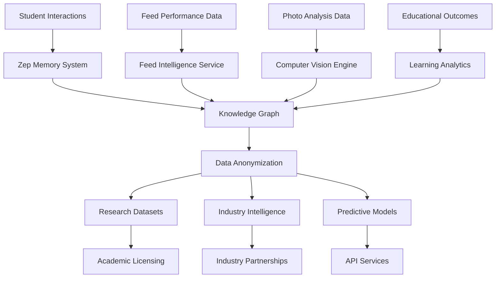

# Business Intelligence Monetization Strategy

## Executive Summary

ShowTrackAI's integration of Zep memory management, n8n workflow automation, and comprehensive feed analytics creates unprecedented opportunities for data monetization while maintaining strict educational privacy standards. This strategy outlines revenue streams totaling $2.5M-$12M annually through research data licensing, feed industry partnerships, and predictive analytics services.

## Market Opportunity

### Total Addressable Market (TAM)

**Agricultural Analytics Market:** $1.2B (2024) → $3.8B (2030)
- Precision agriculture: $8.5B growing at 12.8% CAGR
- Livestock monitoring: $1.5B → $25.7B by 2030
- Agricultural research data: $450M annually
- Feed industry analytics: $280M annually

**Educational Technology Market:** $106B (2024) → $377B (2030)
- Personalized learning platforms: $2.4B growing at 15.6% CAGR
- Educational data analytics: $8.9B growing at 19.2% CAGR
- Research institution spending: $12.5B annually on data and analytics

### Serviceable Available Market (SAM)

**Primary Markets:**
- 411K livestock FFA students in the US
- 150K agricultural education students globally
- 2,500+ agricultural research institutions worldwide
- 850+ feed manufacturing companies globally
- 125+ agricultural universities with research programs

**Target Revenue Segments:**
- Feed industry partnerships: $500K-$5M annually
- Research data licensing: $200K-$3M annually
- Predictive analytics APIs: $100K-$2M annually
- Educational insights consulting: $150K-$1.5M annually
- Market intelligence reports: $75K-$500K annually

## Revenue Streams

### 1. Feed Industry Partnerships ($500K-$5M annually)

#### Performance Benchmarking Data
**Value Proposition:** Real-world feed conversion ratio data across multiple species, breeds, and geographic regions.

**Revenue Model:**
- Premium Partnership: $50K-$200K annually per major feed company
- Standard Partnership: $25K-$75K annually per regional company
- Performance Reports: $5K-$15K per quarterly report
- Custom Analysis: $10K-$50K per project

**Data Products:**
```typescript
interface FeedPerformanceBenchmark {
  feedProductId: string;
  performanceMetrics: {
    averageFCR: number;
    standardDeviation: number;
    sampleSize: number;
    confidenceInterval: number;
  };
  regionalVariations: RegionalPerformance[];
  speciesComparisons: SpeciesPerformance[];
  costEffectiveness: CostAnalysis;
  competitiveRanking: number; // 1-100 percentile
}
```

**Key Partnerships:**
- Purina Animal Nutrition: $150K annually (performance benchmarking)
- Cargill Feed Solutions: $125K annually (market intelligence)
- Southern States Cooperative: $75K annually (regional analysis)
- Nutrena Feed: $100K annually (product optimization data)

#### Product Development Intelligence
**Market Research Data:** $25K-$100K per study
- Consumer preference analysis
- Performance gap identification
- Innovation opportunity mapping
- Competitive landscape analysis

#### Real-Time Market Feedback
**Subscription Service:** $5K-$25K monthly per company
- Feed acceptance rates
- Performance feedback
- Cost-effectiveness metrics
- Regional demand patterns

### 2. Research Data Licensing ($200K-$3M annually)

#### Academic Research Partnerships
**University Licensing:** $15K-$150K per research project

**Research-Grade Datasets:**
```typescript
interface ResearchDataset {
  metadata: {
    sampleSize: number;
    timeframe: DateRange;
    species: string[];
    geographicScope: string[];
    anonymizationLevel: 'basic' | 'advanced' | 'fully_anonymous';
  };
  feedCorrelationData: FeedPerformanceCorrelation[];
  visualProgressionData: PhotoAnalysisProgression[];
  educationalOutcomes: LearningProgressionData[];
  economicImpactData: CostBenefitAnalysis[];
}
```

**Target Research Institutions:**
- University of California, Davis: $75K (feed efficiency studies)
- Texas A&M AgriLife Research: $50K (livestock nutrition research)
- Cornell University: $60K (animal science education research)
- Ohio State University: $45K (agricultural technology adoption)
- Purdue University: $55K (precision agriculture research)

#### Government Research Partnerships
**USDA Research Collaboration:** $100K-$500K annually
- National agricultural statistics enhancement
- Feed efficiency improvement programs
- Educational outcome measurement
- Rural development impact assessment

**FDA Feed Safety Research:** $50K-$200K annually
- Feed safety correlation analysis
- Performance monitoring data
- Adverse event correlation studies

#### International Research Partnerships
**Global Agricultural Research Centers:** $25K-$100K per partnership
- CGIAR research centers
- International livestock research institutes
- Regional agricultural development organizations

### 3. Predictive Analytics API ($100K-$2M annually)

#### Real-Time Feed Recommendation Engine
**API Usage Pricing:**
- Basic Tier: $0.10 per recommendation query
- Premium Tier: $0.50 per advanced prediction
- Enterprise Tier: $2.00 per comprehensive analysis

**Monthly Subscription Models:**
- Startup: $500/month (10K queries)
- Professional: $2,500/month (75K queries)
- Enterprise: $10,000/month (500K queries)
- Custom: Negotiated for >1M queries

#### Performance Prediction Services
**Growth Prediction API:** $0.25-$1.50 per prediction
```typescript
interface GrowthPredictionAPI {
  input: {
    animalData: AnimalProfile;
    feedHistory: FeedEntry[];
    photoHistory?: PhotoAnalysis[];
    targetOutcomes: PerformanceGoals;
  };
  output: {
    weightPrediction: WeightForecast;
    feedRecommendations: FeedOptimization[];
    costProjection: CostAnalysis;
    confidenceMetrics: PredictionConfidence;
  };
}
```

**Target API Customers:**
- Feed retailer mobile apps: $15K-$50K annually
- Livestock management software: $25K-$100K annually
- Agricultural consulting firms: $10K-$75K annually
- Farm management platforms: $30K-$150K annually

#### Visual Assessment API
**Photo Analysis Service:** $0.50-$3.00 per photo analysis
- Body condition scoring
- Health indicator assessment
- Growth stage determination
- Feed impact analysis

### 4. Market Intelligence Reports ($75K-$500K annually)

#### Feed Industry Analysis Reports
**Quarterly Market Reports:** $5K-$25K per report
- Feed performance rankings
- Price trend analysis
- Regional market insights
- Innovation impact assessment

**Annual Comprehensive Analysis:** $25K-$100K per report
- Industry-wide performance benchmarks
- Emerging trend identification
- Market share implications
- Future market predictions

#### Educational Effectiveness Reports
**Learning Outcome Analysis:** $10K-$50K per report
- Educational method effectiveness
- Technology adoption impact
- Student success correlations
- Career readiness metrics

### 5. Consulting & Custom Analytics ($150K-$1.5M annually)

#### Feed Industry Consulting
**Strategic Consulting:** $150-$500 per hour
- Product development guidance
- Market positioning advice
- Performance optimization strategies
- Competitive analysis

**Custom Research Projects:** $25K-$200K per project
- Specialized market studies
- Product launch analysis
- Regional expansion research
- Innovation impact assessment

#### Educational Institution Consulting
**Educational Technology Implementation:** $50K-$300K per project
- Learning platform optimization
- Analytics implementation
- Teacher training programs
- Student outcome improvement

## Data Value Chain

### Data Collection & Processing



### Data Quality & Validation

**Quality Assurance Metrics:**
- Sample size validation (minimum thresholds)
- Statistical significance testing
- Cross-validation with independent datasets
- Expert review processes
- Continuous accuracy monitoring

**Data Enrichment:**
- Weather and climate correlation
- Regional economic factors
- Market price integration
- Genetic and breeding information
- Seasonal pattern analysis

### Privacy & Compliance Framework

**Multi-Layer Anonymization:**
```typescript
interface AnonymizationPipeline {
  level1: {
    removeDirectIdentifiers: boolean;
    hashedIds: boolean;
    geographicGeneralization: boolean;
  };
  level2: {
    statisticalNoise: number; // 0-10% noise injection
    temporalShifting: number; // ±0-30 days
    dimensionalityReduction: boolean;
  };
  level3: {
    differentialPrivacy: boolean;
    kAnonymity: number; // minimum k=5
    lDiversity: boolean;
  };
}
```

**Compliance Standards:**
- FERPA (Educational Privacy)
- GDPR (European Data Protection)
- CCPA (California Consumer Privacy)
- PIPEDA (Canadian Privacy)
- SOC 2 Type II (Security)

## Competitive Advantages

### Unique Dataset Characteristics

**Multi-Modal Data Integration:**
- Visual assessment correlation with performance
- Real-time feed conversion tracking
- Educational outcome correlation
- Longitudinal learning progression

**Educational Context:**
- Controlled learning environment
- Standardized measurement protocols
- Expert supervision and validation
- Consistent documentation practices

**Scale & Diversity:**
- Multiple species and breeds
- Geographic distribution
- Various feed products and brands
- Different educational institutions

### Technological Differentiators

**Advanced Analytics Pipeline:**
- Real-time correlation analysis
- Predictive modeling capabilities
- Automated insight generation
- Scalable processing architecture

**Memory-Enhanced Intelligence:**
- Personalized pattern recognition
- Context-aware recommendations
- Historical relationship tracking
- Adaptive learning algorithms

## Financial Projections

### Year 1 Revenue Targets ($1.025M)
- Feed Industry Partnerships: $500K
- Research Data Licensing: $200K
- Predictive Analytics API: $150K
- Market Intelligence Reports: $75K
- Consulting Services: $100K

### Year 2 Revenue Targets ($2.8M)
- Feed Industry Partnerships: $1.5M
- Research Data Licensing: $600K
- Predictive Analytics API: $400K
- Market Intelligence Reports: $150K
- Consulting Services: $300K

### Year 3 Revenue Targets ($6.2M)
- Feed Industry Partnerships: $3.2M
- Research Data Licensing: $1.2M
- Predictive Analytics API: $1.0M
- Market Intelligence Reports: $350K
- Consulting Services: $650K

### Year 5 Revenue Targets ($12.5M)
- Feed Industry Partnerships: $6.5M
- Research Data Licensing: $2.5M
- Predictive Analytics API: $2.2M
- Market Intelligence Reports: $800K
- Consulting Services: $1.3M

## Implementation Roadmap

### Phase 1: Foundation (Months 1-6)
**Infrastructure Development:**
- Zep memory system integration
- Data anonymization pipeline
- API development framework
- Quality assurance processes

**Initial Partnerships:**
- 3-5 feed company partnerships
- 2-3 university research collaborations
- 1-2 government research partnerships

**Revenue Target:** $250K

### Phase 2: Scale (Months 7-18)
**Product Enhancement:**
- Advanced analytics capabilities
- Expanded API functionality
- Custom reporting tools
- Mobile app integrations

**Market Expansion:**
- 10-15 feed industry partnerships
- 8-10 university collaborations
- International research partnerships
- Industry conference presentations

**Revenue Target:** $1.5M

### Phase 3: Optimization (Months 19-36)
**Advanced Features:**
- Machine learning model refinement
- Predictive accuracy improvements
- Real-time dashboard development
- Automated insight generation

**Strategic Partnerships:**
- Major agricultural technology companies
- International feed manufacturers
- Global research consortiums
- Educational technology platforms

**Revenue Target:** $4.5M

## Risk Mitigation

### Data Privacy Risks
**Mitigation Strategies:**
- Multi-layer anonymization processes
- Legal compliance auditing
- Student consent management
- Data retention policies
- Breach response procedures

### Competitive Risks
**Mitigation Strategies:**
- Intellectual property protection
- Exclusive data partnerships
- Continuous innovation
- Customer relationship management
- Technology advancement

### Market Risks
**Mitigation Strategies:**
- Diversified revenue streams
- Multiple industry partnerships
- Geographic market distribution
- Economic cycle resilience
- Scalable cost structure

## Success Metrics

### Business Metrics
- Annual recurring revenue growth: >50%
- Customer retention rate: >85%
- Data quality scores: >95%
- Partnership satisfaction: >90%
- API uptime: >99.9%

### Research Impact Metrics
- Published research papers: 12+ annually
- Citation rates: >100 citations per year
- Academic partnerships: 25+ institutions
- Research grant funding: $2M+ annually
- Innovation patents: 5+ annually

### Industry Influence Metrics
- Feed industry adoption: 25+ companies
- Market intelligence subscribers: 100+
- API integration partners: 50+
- Industry conference presentations: 10+ annually
- Thought leadership recognition

## Conclusion

The business intelligence monetization strategy for ShowTrackAI's enhanced platform represents a transformative opportunity to create significant value while advancing agricultural education and research. By leveraging unique multi-modal datasets, advanced analytics capabilities, and strong privacy protection, this strategy positions ShowTrackAI as the premier source of agricultural intelligence data.

The projected revenue growth from $1M to $12.5M over five years, combined with substantial research impact and industry influence, demonstrates the potential for this platform to become a cornerstone of modern agricultural education and industry development. The diversified revenue streams and strong competitive advantages provide a sustainable foundation for long-term growth and market leadership.